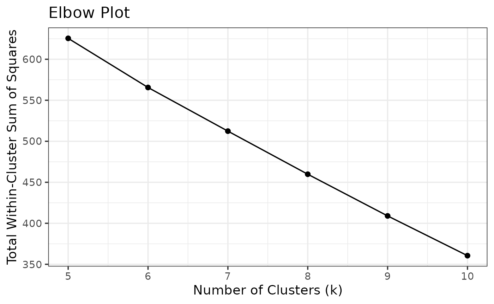

# Command Line Interface

## Using analysiskmeans in CLI

The analysiskmeans package can also be accessed by the command line. A
few example of prompts are shown below!

To get started, if you are looking for the different commands you can
use with this package, use the –help command.

    analysiskmeans --help

If you are looking to retrieve an elbow plot for various Kmeans
clustering iterations, the *elbow* command is the one to use! Here are
the following methods to use with the elbow command:

    Options:
      -c, --counts <COUNTS>       Path to counts matrix (TSV/CSV, genes x samples)
                                  [default: ""] [type: string]
      -gm, --genemeta <GENEMETA>  Path to sample gene metadata (TSV/CSV)
                                  [default: ""] [type: string]
      -cm, --cellmeta <CELLMETA>  Path to sample cell metadata (TSV/CSV)
                                  [default: ""] [type: string]
      -o, --output <OUTPUT>       Output directory [default: ""] [type: string]
      -FALSE, --n-top <N-TOP>     Number of top variable genes
                                  [default: 50] [type: integer]
      -mn, --min-k <MIN-K>        Minimum K Value [default: 5] [type: integer]
      -mx, --max-k <MAX-K>        Number of top variable genes
                                  [default: 10] [type: integer]

If you are looking to retrieve clustering kmeans plots for various
Kmeans clustering iterations, the *cluster* command is the one to use!
Here are the following methods to use with the cluster command:

    Options:
      -c, --counts <COUNTS>           Path to counts matrix (TSV/CSV, genes x
                                      samples)
                                      [default: ""] [type: string]
      -gm, --genemeta <GENEMETA>      Path to sample gene metadata (TSV/CSV)
                                      [default: ""] [type: string]
      -cm, --cellmeta <CELLMETA>      Path to sample cell metadata (TSV/CSV)
                                      [default: ""] [type: string]
      -o, --output <OUTPUT>           Output directory [default: ""] [type: string]
      -FALSE, --n-top <N-TOP>         Number of top variable genes
                                      [default: 50] [type: integer]
      -mn, --min-k <MIN-K>            Minimum K Value [default: 5] [type: integer]
      -mx, --max-k <MAX-K>            Number of top variable genes
                                      [default: 10] [type: integer]
      -mx, --selected-k <SELECTED-K>  A Selected K Value for Plotting
                                      [default: 7] [type: integer]

Let’s get started with a few examples!

Firstly, let’s install analysiskmeans. Also, read_data_file is a helper
function to load in a dataset in a csv/tsv format

``` r
read_data_file <- function(path) {
  ext <- tolower(tools::file_ext(path))
  if (ext == "csv") {
    utils::read.csv(path, row.names = 1, check.names = FALSE)
  } else {
    utils::read.table(path, sep = "\t", header = TRUE, row.names = 1,
                      check.names = FALSE)
  }
}
```

The following example starts by constructing input files!

``` r
set.seed(42)
num_genes <- 100
num_cells <- 20 #Used to be 8
raw_counts <- as.integer(rexp(num_genes*num_cells, rate = 0.1))
raw_counts <- matrix(raw_counts, nrow = num_genes, ncol = num_cells)

gene_metadata <- data.frame(
  name = paste("Gene", 1:num_genes, sep = "_"),
  length = as.integer(rnorm(num_genes, mean = 10000, sd = 500))
)

cell_metadata <- data.frame(
  names = paste("Cell", 1:num_cells, sep = "_"),
  batch = rep(1:2, each = num_cells/2),
  label = rep(c("xylem", "phloem"), times = num_cells/2)
)
```

We can continue by writing the inputs into files in a tests/cli folder!

``` r
#reading the files and beginning the CLI simulation 

#Due to the vignette structure

counts_df <- read_data_file(paste(dirname(getwd()),"/tests/cli/counts_df.csv", sep = ""))
genemeta_df <- read_data_file(paste(dirname(getwd()),"/tests/cli/genemeta_df.csv", sep = ""))
cellmeta_df <- read_data_file(paste(dirname(getwd()),"/tests/cli/cellmeta_df.csv", sep = ""))
```

Next, we can make an SingleCellExperiment object with the dataframes
from the files!

``` r
sce1 <- SingleCellExperiment(
  assays = list(counts = as.matrix(counts_df)),
  rowData = genemeta_df,
  colData = cellmeta_df
)
```

After the file is fetched, and the object is saved, we can run our
functions and start conducting the analysis! We can start by using the
elbow plot function! We are also saving our elbow plot in an image in
our repository.

``` r
results <- analysiskmeans::data_config(sce1)
```

    ## Warning in .library_size_factors(assay(x, assay.type), ...): 'librarySizeFactors' is deprecated.
    ## Use 'scrapper::centerSizeFactors' instead.
    ## See help("Deprecated")

    ## Warning in .local(x, ...): 'normalizeCounts' is deprecated.
    ## Use 'scrapper::normalizeCounts' instead.
    ## See help("Deprecated")

``` r
sce1 <- results$sce
mat_norm <- analysiskmeans::top_x_genes(sce1, n_top = 50)
pca <- analysiskmeans::computepca(mat_norm)
max_k <- 10
min_k = 5
outputs <- analysiskmeans::k_means(min_k = min_k, max_k=max_k, pca = pca)
metrics<-outputs$metrics
plot1 <- analysiskmeans::elbow_plot(metrics)
```


