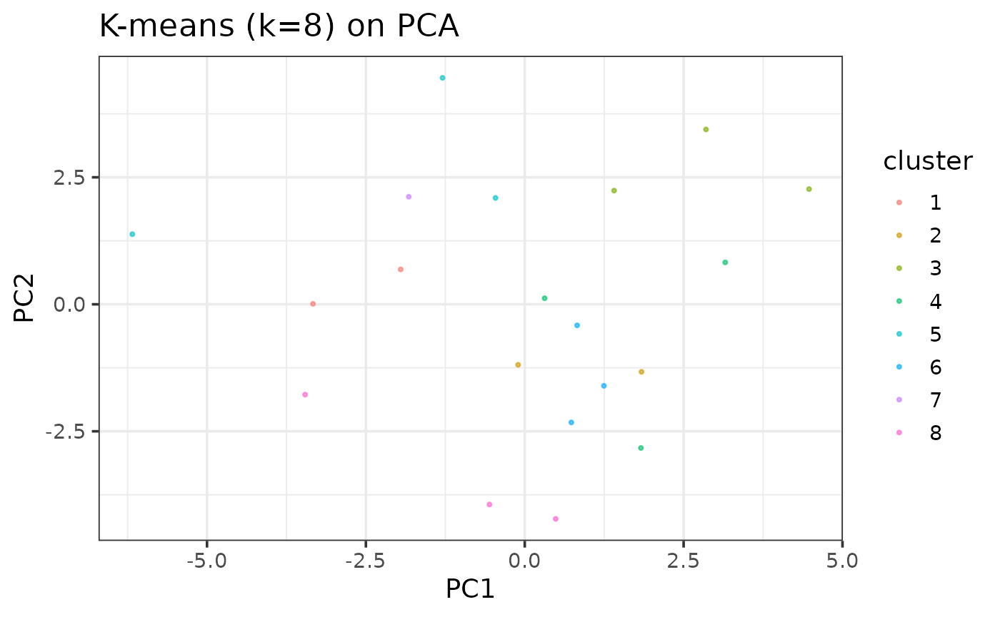

# Package Functions

\##Functions this package provides!

## Example: data_config()

This is a basic example of how to use the data_config function to set up
your SingleCellExperiment data so that it is usable for functionality in
this package!

    ## Warning in .library_size_factors(assay(x, assay.type), ...): 'librarySizeFactors' is deprecated.
    ## Use 'scrapper::centerSizeFactors' instead.
    ## See help("Deprecated")

    ## Warning in .local(x, ...): 'normalizeCounts' is deprecated.
    ## Use 'scrapper::normalizeCounts' instead.
    ## See help("Deprecated")

## Example: top_x_genes()

Next, we can take a look creating a subset of our data including a
particular number of top selected genes! Keep in mind that if you do not
fill in a parameter value for n_top, 50 will be the default value. A
small portion of this subset is shown below.

``` r
  utils::data(example_sce, package="analysiskmeans")
  sce <- example_sce
  results <- data_config(sce)
```

    ## Warning in .library_size_factors(assay(x, assay.type), ...): 'librarySizeFactors' is deprecated.
    ## Use 'scrapper::centerSizeFactors' instead.
    ## See help("Deprecated")

    ## Warning in .local(x, ...): 'normalizeCounts' is deprecated.
    ## Use 'scrapper::normalizeCounts' instead.
    ## See help("Deprecated")

``` r
  sce <- results$sce
  mat_norm <- top_x_genes(sce, n_top = 50)
mat_norm[1:5,1:5]
```

    ##          [,1]     [,2]     [,3]     [,4]     [,5]
    ## [1,] 6.291017 0.000000 0.000000 3.364813 2.277725
    ## [2,] 2.226863 5.094011 0.000000 0.000000 5.469322
    ## [3,] 2.226863 2.166704 4.887945 3.951340 3.272103
    ## [4,] 5.990491 4.978982 3.593868 5.331774 3.948061
    ## [5,] 5.948110 4.062194 2.899177 1.023982 3.649314

## Example: computepca()

We can now compute a PCA analysis as a part of doing Kmeans. Within
this, we will need to pass the mat_norm object we just created into the
computepca() function. A few outputs of the pca function are shown
below.

``` r
  utils::data(example_sce, package="analysiskmeans")
  sce1 <- example_sce
  results1 <- data_config(sce1)
```

    ## Warning in .library_size_factors(assay(x, assay.type), ...): 'librarySizeFactors' is deprecated.
    ## Use 'scrapper::centerSizeFactors' instead.
    ## See help("Deprecated")

    ## Warning in .local(x, ...): 'normalizeCounts' is deprecated.
    ## Use 'scrapper::normalizeCounts' instead.
    ## See help("Deprecated")

``` r
  sce1 <- results1$sce
  mat_norm1 <- top_x_genes(sce1, n_top = 50)
  pca1 <- computepca(mat_norm1)
  pca1$sdev[1:5]
```

    ## [1] 2.517584 2.402654 2.197769 2.060160 1.984220

## Example: kmeans()

The kmeans function conducts clustering in an iterative fashion, going
from inputted parameters of minimum k values to maximum k values. The
km_list object contains a large amount of information about the
clustering. The metrics object contains wss and average silhouette
scores with corresponding to each k value in our range. An example of
what metrics looks like is shown below.

``` r
  utils::data(example_sce, package="analysiskmeans")
  sce <- example_sce
  results <- data_config(sce)
```

    ## Warning in .library_size_factors(assay(x, assay.type), ...): 'librarySizeFactors' is deprecated.
    ## Use 'scrapper::centerSizeFactors' instead.
    ## See help("Deprecated")

    ## Warning in .local(x, ...): 'normalizeCounts' is deprecated.
    ## Use 'scrapper::normalizeCounts' instead.
    ## See help("Deprecated")

``` r
  sce <- results$sce
  mat_norm <- top_x_genes(sce, n_top = 50)
  pca <- computepca(mat_norm)
  max_k <- 10
  min_k <-5
  outputs <- k_means(min_k = min_k, max_k=max_k, pca = pca)
  metrics<-outputs$metrics
  km_list <- outputs$km_list
  metrics
```

    ##    k      wss avg_silhouette
    ## 1  5 625.5026     0.06131297
    ## 2  6 565.5828     0.06596026
    ## 3  7 512.3719     0.06487671
    ## 4  8 459.8210     0.06096352
    ## 5  9 411.0190     0.05909937
    ## 6 10 360.5383     0.06911235

## Example: cluster_plot()

Our cluster_plot() function takes outputs from the kmeans function and
plots the data based on principal components. An example plot is shown
above, and each cluster is differentiated by color. We plot the
following based on an example selected k value. In this case we have
chosen a value of 8 as an example.

``` r
plot <- cluster_plot(selected_k=8, km_list, pca, results$cell_type)
```


